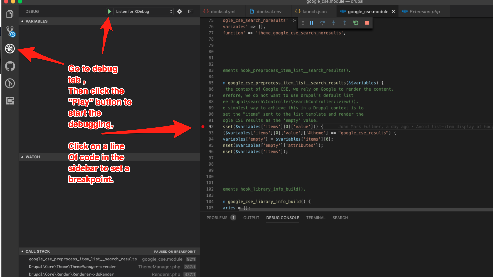
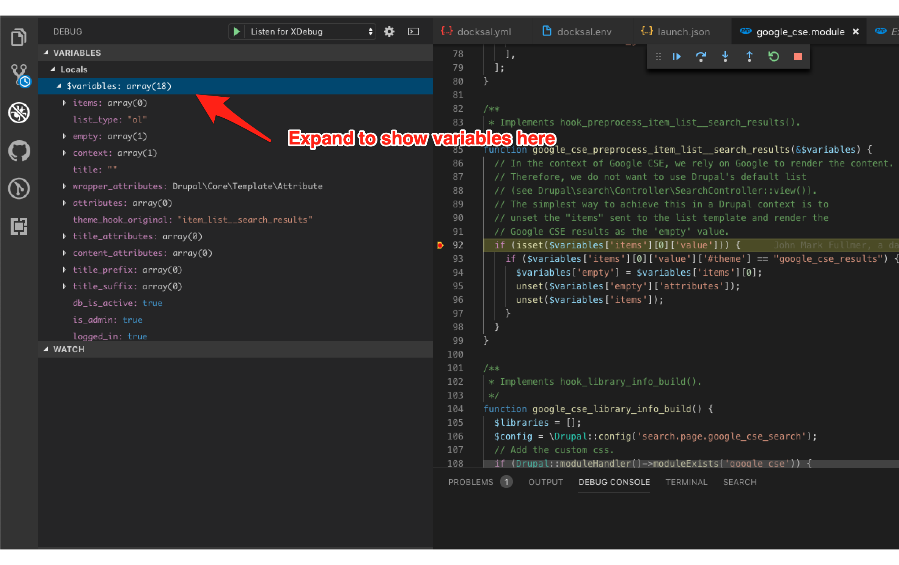

# Docksal Local development

## Install Docksal
https://docs.docksal.io/getting-started/setup/

## Install Terminus
https://pantheon.io/docs/terminus/install

## Configuring the docroot
* If you have your site inside another folder, e.g. `web`, set that in the `docksal.env` as the `DOCROOT` setting. Otherwise, leave it as the default `.` setting.

## Configure the `init-site` command
* If you're using Drupal 7, adjust the `init_settings()` function in the `init-site` command so that the appropriate local settings file is copied when setting up.

## Initialize containers.
* `fin init`

## Setup Drupal with required files.
* `fin init-site`

## Running tests
* For first time setup, run `fin test-init`. This will copy over the default files from the `.docksal/drupal/testing-defaults` folder, and update them to match your current Docksal virtual host.
* There are 2 commands to run testing - `test`, for functional testing, and `test-js`, for Javascript based testing. More details on the commands can be found in the command files themselves - `.docksal/commands/test` and `.docksal/commands/test-js`. They both function largely the same way, but are configured to use corresponding `phpunit.xml` files located in `.docksal/drupal/testing` folder.
* To ensure proper functionality, the `SIMPLETEST_BASE_URL` has to be updated to match the Docksal virtual host name. In most cases, this is taken care of when running `fin test-init`. As part of this command, it will update the appropriate `phpunit.xml` files automatically. This does a basic find and replace operation via perl, replacing the default `web` string with the Docksal variable `${VIRTUAL_HOST}`.
* If the command doesn't work for you for some reason, you can manually update the `SIMPLETEST_BASE_URL` in the included `phpunit.xml` and `phpunit-js.xml`, located in `.docksal/drupal/testing/`. In Docksal, the name of your host matches the name of your folder. So, if you cloned this into a folder called `drupalin`, your Docksal based URL will be `http://drupalin.docksal`, and this is what your `SIMPLETEST_BASE_URL` should be set to.

## Setting different versions of PHP
* The `docksal.env` file contains some sample definitions of the different pieces of the stack. `WEB_IMAGE`, `DB_IMAGE`, and `CLI_IMAGE` can be modified to use different Docker images from the Docksal repo. The PHP version is determined from the `CLI_IMAGE`. You can modify the value to a new version, and run `fin up` to refresh the containers. Docksal will detect the changes, download the new Docker image if it doesn't exist in your cache, and reload your container running the new PHP version. So for example, to run on PHP 7.3, you could update the `CLI_IMAGE` to be `CLI_IMAGE='docksal/cli:2.6-php7.3'`, and run `fin up`, and now the CLI container is running on PHP 7.3. And to clarify, the CLI container is determining what version of PHP that Drupal will be using, since Drupal is in essence running on this container, in orchestration with the `WEB_IMAGE` and `DB_IMAGE` containers, which are networked together automatically behind the scenes. [See more information about this from the Docksal site](https://docs.docksal.io/service/cli/settings/).

## Overriding PHP / MySQL settings
* It's possible to override PHP settings as needed. Some examples are included in the `example-php-mysql-overrides` folder.
* Docksal will look for PHP overrides in `.docksal/etc/php` - for more in depth information, see [the Docksal documentation](https://docs.docksal.io/service/cli/settings/)
* Docksal will look for MySQL overrides in `.docksal/etc/mysql` - for more in depth information, see [the Docksal documentation](https://docs.docksal.io/service/db/settings/)

## XDebug
This should provide "out of the box" xdebugging ability
Test steps:
* Add `XDEBUG_ENABLED=1` to your `docksal-local.env`, and do a `fin up` to reload the containers with XDebug enabled. If you haven't already setup a `php.ini`, add one, or update `/etc/php/php.ini` settings with desired XDebug preferences (see `.docksal/example-php-mysql-overrides/etc/php/php.ini`), and do a `fin project restart` to apply the new settings. *NOTE*: Having `XDEBUG_ENABLED=1` will slow down performance, so consider setting back to `0` and running `fin up` to unload it if not actively using.
* Download [VSCode debug extension](https://marketplace.visualstudio.com/items?itemName=felixfbecker.php-debug)
* Go to the "debug" tab and start debugging:

* When you refresh the site in a spot where that code executes, it should jump you into vscode

## Pantheon
### Configure environment variables
* In `docksal.env`, set `PROJECT_NAME` to establish the Pantheon project name which is used in scripted terminus commands, and `PANTHEON_SITE_ENV` for the preferred environment to sync from when using applicable commands.

### Syncing from Pantheon
* Use `fin rsync` to sync files from the `PANTHEON_SITE_ENV` defined.
* Use `fin sync-db` to sync DB from the `PANTHEON_SITE_ENV` defined.